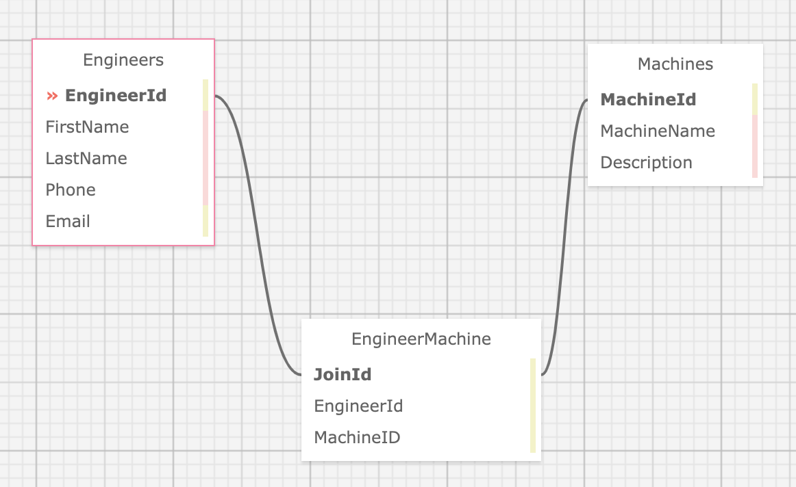

# Dr. Sillystringz Factory

#### Independent Project for Epicodus Coding School on ASP.NET Core MVC, Entity Framework, & Many-to-Many Relationships

#### Project Began on 1.8.2021

#### By Danielle Thompson

---

## Description

This MVC web application is to keep track of a factory's machine repairs by managing their engineers and the machines they are licensed to fix. Engineers & machines can both be added to their prospective lists, and specifications can be added to designate which engineers are licensed to repair which machines. Engineers & Machines have a many-to-many relationship, where an engineer can repair many machines, and, vice versa, a machine can have many engineers licensed to repair it.



## Stretch Goals

TODO

---

## Technologies Used/Required

- C# v 7.3
- .NET Core v 2.2
- MySQL, MySQL Workbench
- Entity Framework Core, CRUD, RESTful routing
- dotnet script, REPL
- ASP.NET MVC Core
- Razor
- [SQL Design Planner](https://ondras.zarovi.cz/sql/demo/)
- [Visual Code Studio](https://code.visualstudio.com/)

---

## Installation Requirements

#### Installing Git

###### For Mac Users

- Access Terminal in your Finder, and open a new window. Install the package manager, (Homebrew) [https://brew.sh/], on your device by entering this line of code in Terminal: `$ /usr/bin/ruby -e "$(curl -fsSL https://raw.githubusercontent.com/Homebrew/install/master/install)"`.
- Ensure Homebrew packages are run with this line of code: `echo 'export PATH=/usr/local/bin:$PATH' >> ~/.bash_profile`.
- Once homebrew is installed, install Git, a version control system for code writers, with this line of code `brew install git`.

###### For Windows Users

- Open a new Command Prompt window by typing "Cmd" in your computer's search bar.
- Determine whether you have 32-bit or 64-bit Windows by following these (instructions)[https://support.microsoft.com/en-us/help/13443/windows-which-version-am-i-running].
- Go to (Git Bash)[https://gitforwindows.org/], click on the "Download" button, and download the corresponding exe file from the Git for Windows site.
- Follow the instructions in the set up menu.

#### Installing C#, .NET, dotnet script, & MySQL

- Install C# and .Net according to your operating system below.

###### For Mac

- Download this .NET Core SDK (Software Development Kit)[https://dotnet.microsoft.com/download/thank-you/dotnet-sdk-2.2.106-macos-x64-installer]. Clicking this link will prompt a .pkg file download from Microsoft.
- Open the .pkg file. This will launch an installer which will walk you through installation steps. Use the default settings the installer suggests.
- Confirm the installation is successful by opening your terminal and running the command $ dotnet --version, which should return something like: `2.2.105`.

###### For Windows (10+)

- Download either the 64-bit .NET Core SDK (Software Development Kit)[https://dotnet.microsoft.com/download/thank-you/dotnet-sdk-2.2.203-windows-x64-installer]. Clicking these links will prompt an .exe file download from Microsoft.
- Open the file and follow the steps provided by the installer for your OS.
- Confirm the installation is successful by opening a new Windows PowerShell window and running the command dotnet --version. You should see something a response like this: `2.2.105`.

#### For Mac & Windows Operating Systems

- Install dotnet script with the following terminal command `dotnet tool install -g dotnet-script`.

#### Clone or Download the Project

##### To Clone
1. Once you have Git installed on your computer, go to this (GitHub repository)[https://github.com/dani-t-codes/Sillystringz.Solution].
2. Click the Green 'Code' button.
3. Copy the HTTPS link, and open a Terminal or CMD on your local system.
4. In the Terminal/CMD, navigate to your Desktop with the command `cd Desktop`.
4. Clone this application onto your local Terminal or CMD with the following command:`git clone https://github.com/dani-t-codes/Sillystringz.Solution.git`.
5. Navigate to the project from your Terminal/Cmd with the command `cd Sillystringz.Solution`.

##### To Download
1. Alternatively, click the Green 'Code' button from the GitHub repository listed above.
2. Select the "Download Zip" from the dropdown options.
3. Open/unzip the file that has been downloaded to your local system.
4. Open VSCode, or another code editor of your choice, and navigate to the unzipped file folder from File>Open...>Sillystringz.Solution to view the project.

##### .NET Core Commands

When the project is opened on your local machine...
- `dotnet build` will get bin/ and obj/ folders downloaded.
- `dotnet restore` to install packages listed in project's boilerplate.
- `dotnet run` will run the application.

(Ensure you are in the project's root directory, Factory, in your Terminal/CMD before running these commands.)

#### Setting up a Local Database

- Download [MySQL Server](https://dev.mysql.com/downloads/file/?id=484914).
- Download [MySQL Workbench](https://dev.mysql.com/downloads/file/?id=484391).
- (For more detailed instructions, if either of the above technologies are unfamiliar to you, visit [this site](https://www.learnhowtoprogram.com/c-and-net/getting-started-with-c/installing-and-configuring-mysql) and follow the instructions for your local OS).
- Run `dotnet ef migrations add Initial`
  --> If there is an error stating "Unable to resolve project", this means the command wasn't run in the correct directory.
- Entity creates three files in the Migrations directory.
- Run the following command: `dotnet ef database update`.

#### MySQL Password Protection & .gitignore

1. Create a file in the root directory of the project called "appsettings.json". Add the following snippet of code to the appsettings.json file:

```
{
  "ConnectionStrings": {
    "DefaultConnection": "Server=localhost;Port=3306;database=registrar;uid=root;pwd=YOUR-PASSWORD-HERE;"
    }
}
```

2. Where you see "YOUR-PASSWORD-HERE" is where you put the password you created for your MySQL server. Your server name and port might vary depending on your local system. Check MySQL Workbench Connections to determine if the local host and port number match and adjust as needed.

3. Create a .gitignore file and add the following files & folders to it:

- obj/
- bin/
- .vscode/
- .DS_Store
- appsettings.json

---

## Known bugs

No known bugs as of now. [Please report any bugs found here.](https://github.com/dani-t-codes/Sillystringz.Solution/issues)

### Legal, or License

_MIT_ Copyright (c) 2021 _*Danielle Thompson*_